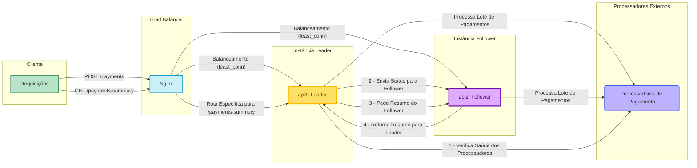

# Rinha de Backend 2025 - Proxy de Pagamentos com Bun

## Igor Gregori

### Tecnologias Utilizadas

- **Linguagem:** TypeScript
- **Runtime:** [Bun](https://bun.sh/) (v1.2.18)
- **Servidor HTTP:** API nativa do Bun (`Bun.serve`)
- **Load Balancer:** [Nginx](https://www.nginx.com/)
- **Containerização:** Docker

---

## Arquitetura e Estratégia

A solução foi projetada com foco em três pilares: **máxima performance**, **resiliência a falhas** e **maximização de lucro**, respeitando os limites de recursos impostos pelo desafio.

A arquitetura consiste em duas instâncias da aplicação (`leader` e `follower`) e um Nginx atuando como um load balancer inteligente.

### Diagrama da Arquitetura

### Decisões Estratégicas

#### 1. Processamento Assíncrono com Worker Threads

Para garantir que o endpoint `POST /payments` seja extremamente rápido (p99 baixo), a aplicação não espera o processamento do pagamento.

- O servidor HTTP (`http-server.ts`) recebe a requisição, a valida e a envia imediatamente para um **Worker Thread** (`worker.ts`).
- Ele retorna `HTTP 201 Created` sem bloquear a thread principal.
- O Worker mantém uma fila (`paymentBuffer`) em memória e processa os pagamentos em lotes (`processBatch`), de forma totalmente assíncrona.

#### 2. Balanceador de Carga Inteligente (Nginx)

O Nginx foi configurado para máxima performance e roteamento inteligente:

- **`least_conn`**: As requisições `POST /payments` são distribuídas para a instância com o menor número de conexões ativas, garantindo um balanceamento de carga mais eficaz que o `round-robin`.
- **`keepalive`**: Mantemos um pool de conexões abertas com as instâncias backend, reduzindo drasticamente a latência ao evitar o custo de handshakes TCP repetidos.
- **Roteamento Específico**: Requisições `GET /payments-summary` são **sempre** direcionadas para a instância `leader`. Isso centraliza a lógica de agregação e garante consistência nos dados.

#### 3. Lógica de Decisão do Processador (O Cérebro)

A função `getProcessorToUse` no worker é o coração da estratégia para maximizar o lucro:

- **Prioridade ao Lucro**: O processador `default` é sempre a primeira opção.
- **Circuit Breaker Simples**: Se o `default` estiver comprovadamente falhando (`failing: true`), o sistema muda imediatamente para o `fallback`.
- **Análise de Performance com Tolerância**: A decisão de usar o `fallback` (mais caro) só é tomada se o `default` estiver **significativamente mais lento** (um limiar de 30% foi definido). Isso evita trocas desnecessárias por flutuações mínimas de latência, protegendo a margem de lucro.

#### 4. Comunicação e Agregação entre Instâncias

- A instância `leader` é a única responsável por verificar a saúde dos processadores (`processors-status-checker.ts`).
- Ela envia o status atualizado para a `follower` via uma requisição HTTP "fire-and-forget" com timeout, para não bloquear seu próprio ciclo.
- Ao receber uma requisição de `GET /payments-summary`, a `leader` busca o resumo de seu próprio worker e, **em paralelo** (`Promise.all`), busca o resumo da `follower` através de um endpoint interno (`/internal/payments-summary`).
- Os resultados são somados na `leader` antes de retornar a resposta final, garantindo uma visão completa e consistente do sistema.

#### 5. Armazenamento em Memória

Para atender aos requisitos de velocidade e consistência, todos os dados de pagamentos processados são mantidos em um array na memória do worker. A agregação para o `summary` é feita em tempo real, iterando sobre este array. Foi escolhido armazenar o `timestamp` como um número (`Date.now()`) por ser mais performático e economizar memória em comparação com strings
